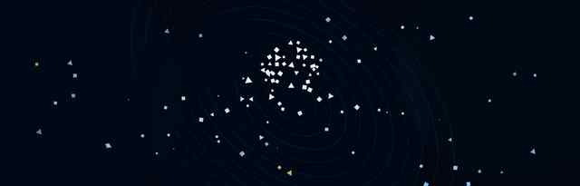

<div align="center">



# A/JUNCTION: 공통좌표

### 아주대학교 중앙도서관 미디어월을 위한 코드 기반 미디어아트

**제1회 중앙도서관 미디어아트 영상 공모전 · 우수상**


</div>

---

## Overview

**A/JUNCTION: 공통좌표**는 아주대학교 중앙도서관을 서로 다른 학문이 만나고 교차하는 하나의 **Junction**으로 해석한 미디어아트 모션그래픽이다.

공학, ICT, 소프트웨어, 자연과학, 바이오, 의·약학, 간호, 경영, 사회과학, 인문, 국제학 등 서로 다른 학문 분야를 각기 다른 **점·선·면·파동·네트워크·궤도**의 움직임으로 형상화했다. 각자의 방향으로 전개되던 요소들은 도서관이라는 공통좌표에서 교차하고 연결되며, 마지막에는 하나의 형상으로 수렴해 **아주대학교 심볼**을 완성한다.

작품명 **A/JUNCTION**은 **AJOU**의 `A/J`와 서로 다른 흐름이 만나는 **Junction**을 결합한 이름이다.

---

## Award

<div align="center">

### 제1회 중앙도서관 미디어아트 영상 공모전  
### 우수상


**아주대학교 중앙도서관 · 2026.09.11**

</div>

---

## Artwork

| Item | Description |
|---|---|
| Title | **A/JUNCTION: 공통좌표** |
| Type | Media Art / Motion Graphics |
| Exhibition | 아주대학교 중앙도서관 미디어월 |
| Resolution | **5200 × 1664** |
| Runtime | 약 **1분 55초** |
| Frame Rate | 24 fps |
| Production | Python / Manim Community / FFmpeg |
| Award | **제1회 중앙도서관 미디어아트 영상 공모전 우수상** |

---

## Concept

아주대학교 중앙도서관은 특정 전공에 한정된 공간이 아니라, 서로 다른 단과대의 학생들이 같은 공간에서 학습하고 지식을 확장하는 장소다.

이 작품은 도서관을 다양한 학문이 만나는 **공통좌표(Common Coordinate)** 로 바라본다. 각 학문 분야는 고유한 시각 언어와 운동 규칙을 갖고 독립적으로 전개되지만, 장면이 이어질수록 서로 연결되고 마지막에는 하나의 아주대학교 심볼로 결집한다.

```text
Different disciplines
        ↓
Different visual languages
        ↓
Intersection & connection
        ↓
A common coordinate
        ↓
AJOU
```

---

## Visual Timeline

| Timeline | College / Field | Visual Motif |
|---|---|---|
| 00:00–00:09 | 공과대학 | 기계 구조, 결정 격자, 트러스, 유체 흐름 |
| 00:09–00:17 | 첨단ICT융합대학 | 회로, 반도체, 신호, 센서 파동 |
| 00:17–00:25 | 소프트웨어융합대학 | 데이터, 보안, AI 네트워크 |
| 00:25–00:34 | 자연과학대학 | 좌표, 파동, 원자, 세포 |
| 00:34–00:42 | 첨단바이오융합대학 | DNA, 단백질, 바이오 네트워크 |
| 00:42–00:50 | 약학대학 | 캡슐, 분자, 수용체, 확산 |
| 00:50–00:58 | 의과대학 | 인체 단면, 진단 스캔, 조직 |
| 00:58–01:06 | 간호대학 | 환자 침상, 생체신호, IV, 돌봄 네트워크 |
| 01:06–01:14 | 경영대학 | 의사결정, 데이터 그래프, 시장 |
| 01:14–01:22 | 사회과학대학 | 개인과 집단, 제도, 사회 연결 |
| 01:22–01:30 | 인문대학 | 책, 언어, 음성, 시간축 |
| 01:30–01:38 | 국제학부 | 지구, 교류 궤도, 국제 연결 |
| 01:38–01:45 | 다산학부대학 / 자유전공 | 선택과 분기, 학문 경로 |
| 01:45–01:55 | **Convergence** | 모든 형상이 수렴해 Ajou Symbol 완성 |

---

## Implementation

### Code-driven Motion Graphics

전체 애니메이션은 **Manim Community**를 기반으로 제작했다. 위치, 회전, 스케일, 궤적, 파동, 네트워크 연결을 코드로 제어해 각 학문 분야의 특징을 서로 다른 움직임의 규칙으로 변환했다.

메인 소스:

```text
src/ajou_field_v2_manim.py
```

### Ultra-wide Media Wall

일반적인 16:9 영상이 아닌 **5200 × 1664** 초광폭 미디어월을 기준으로 구성했다. 화면 중앙에 요소가 집중되지 않도록 전체 폭을 활용하고, 장면 전환에서도 좌우 공간의 흐름이 이어지도록 설계했다.

### Final Sequence

후반부로 갈수록 화면의 요소와 음악적 에너지가 함께 상승하고, 마지막 약 10초 동안 앞선 장면의 기하학적 파편들이 한 지점으로 수렴한다. 최종 프레임에서는 모든 학문적 흐름이 아주대학교 심볼로 결집하며 작품의 구조를 완성한다.

---

## Repository Structure

```text
AJunction_MediaArt/
├─ README.md
├─ requirements.txt
├─ render_preview.sh
├─ render_final.sh
├─ .gitattributes
├─ .gitignore
├─ assets/
│  ├─ hero.jpg
│  └─ award_certificate.jpg
└─ src/
   └─ ajou_field_v2_manim.py
```

---

## Render

### Requirements

- Python 3
- Manim Community
- NumPy
- Pillow
- FFmpeg

```bash
pip install -r requirements.txt
```

### Preview

```bash
./render_preview.sh
```

### Media-wall Render

```bash
./render_final.sh
```

---

## Creator

**송재혁 · Song Jaehyeok**  
Digital Media, Ajou University

<div align="center">

### A/JUNCTION
**Different disciplines. One common coordinate.**

</div>
